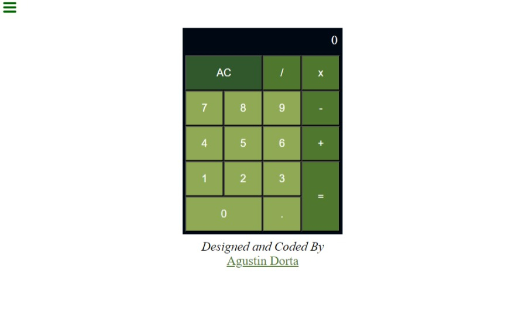

# Calculator

## Descripción
This project is a calculator made with React and Redux that solves the four basic mathematical operations: addition, subtraction, multiplication and division.

## Tabla de Contenidos

- [Installation and Use](#Installation-and-Use)
- [File Structure](#File-Structure)
- [Used technology](#Used-technology)
- [Contact](#Contact)
- [Screenshots](#Screenshots)

## Installation and Use
1. Clone the repository: `git clone <Repository URL>`
2. Navigate to the project directory: `cd <directory name>`
3. Install the dependencies: `npm install @reduxjs/toolkit mathjs styled-components react-redux`

 ## File Structure
- `index.html`: HTML main file.
- `author.jsx`: Component with contact details.
- `display.js`: Calculator display component.
- `keypad.jsx`: Component with calculator buttons.
- `store.js`: Global application status.
- `slices.js`: File with reducers and application logic.
- `main.jsx`: Main React file.
- `App.jsx`: React file with the app code.
- `.gitignore`: Git configuration file.
- `README.md`: Project documentation.

## Used technology
- HTML
- styled-components
- JavaScript
- React
- reduxjs/toolkit
- react-redux
- mathjs 
- Git

## Contact
- Email: yoelagustindorta@gmail.com
- Twitter: @Djoelagustin
- Linkedin: Joel Agustín Dorta

## Project status
This project is finished.

## Screenshots
